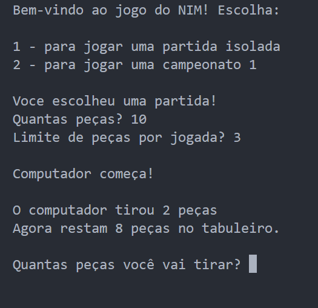
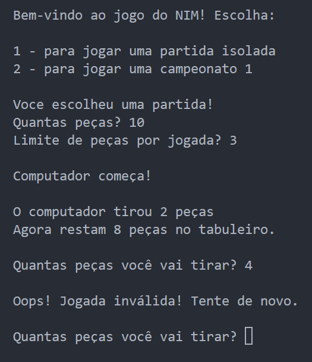
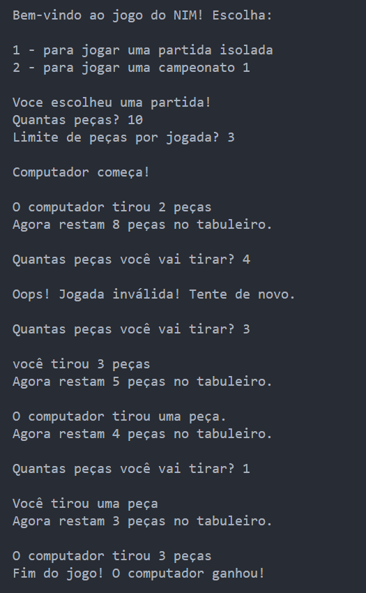

# NIM 🎮

## 📌 Sobre o Jogo:
<b>Objetivo</b>: Jogo que consiste em retirar um número de peças estabelecido previamente contra uma máquina, vence aquele que retirar a última peça do tabuleiro. Para isto, antes do jogo começar, é solicitado um número inicial de peças <b>(m)</b> e um limite de peças <b>(n)</b> para retirada  por jogada. Um exemplo para ficar mais claro:

- <b>m</b>: 10
- <b>n</b>: 3

Nesta situação, o tabuleiro tem 10 peças e ambos os jogadores tem a possibilidade de retirar de 1 até 3 peças por jogada.

<b>Estratégia do Computador</b>: No desenvolvimento do jogo, foi implementando um algoritmo de escolha que consiste em deixar um número de peças equivalente a um múltiplo de m + 1 ao jogador, caso isso não seja possível a máquina simplesmente retira o número máximo de peças possíveis.

<b>Opções de partida</b>: Após iniciar o programa, o usuário possui duas opções:
- <b>Partida</b>: Jogar 1 rodada
- <b>Campeonato</b>: Jogar 3 rodadas

## 📌 Integrantes envolvidos no projeto:
- Lucca de Sena Barbosa

## 📌 Imagens Demonstrativas do Algoritmo:

### 1. Inicial: 
- O jogo foi iniciado no modo partida e foi determinado que a quantidade de peças totais será 10 e o limite de peças por jogada será 3.  

</img>

### 2. Tratamento após limite excedido:
- Após o usuário digitar algum valor de retirada incoerente, o programa retorna uma mensagem pedindo ao usuário um outro valor.  

</img>

### 3. Vitória do Computador:
</img>